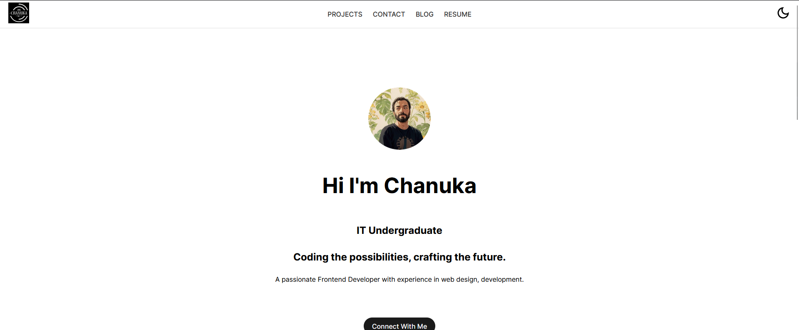
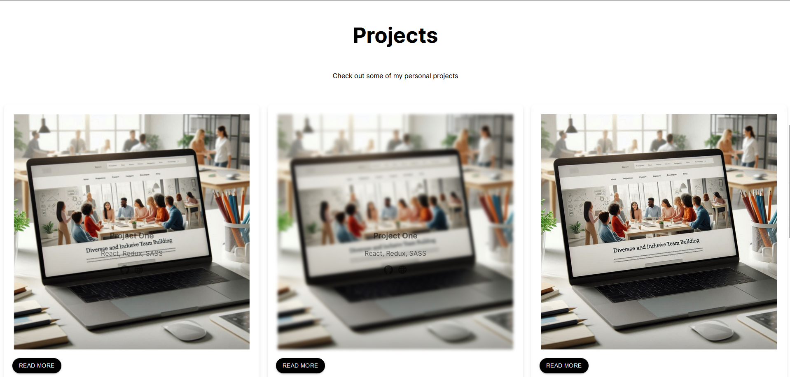

# My Portfolio 🚀

Welcome to my vibrant portfolio website built with React.js! Explore my projects, learn about my skills, and get in touch with me.

About

This portfolio showcases my projects, skills, and experience in web development. It's designed to be visually appealing and user-friendly, providing visitors with an immersive experience.
Live Demo

🌐 View Live Demo - https://chanuka.vercel.app/

Technologies Used

    Frontend: React.js, CSS
    Deployment: Vercel

Features

    Projects Showcase: Browse through my latest projects with project descriptions and links.
    Skills & Expertise: Discover my skills and expertise in web development technologies.
    Contact Form: Get in touch with me using the contact form provided.

Getting Started

    Clone the Repository:
        Clone this repository to your local machine.

    Install Dependencies:
        Run npm install in the project directory to install the required dependencies.

    Start the Development Server:
        Run npm start to start the development server.

    Open in Browser:
        Open http://localhost:3000 in your browser to view the website locally.

Screenshots

Here are some screenshots of the portfolio:

License

This project is licensed under the MIT License. See the LICENSE file for details.
Contact

For any inquiries or collaboration opportunities, feel free to reach out to me at chanukasaweerasinghe@gmail.com
